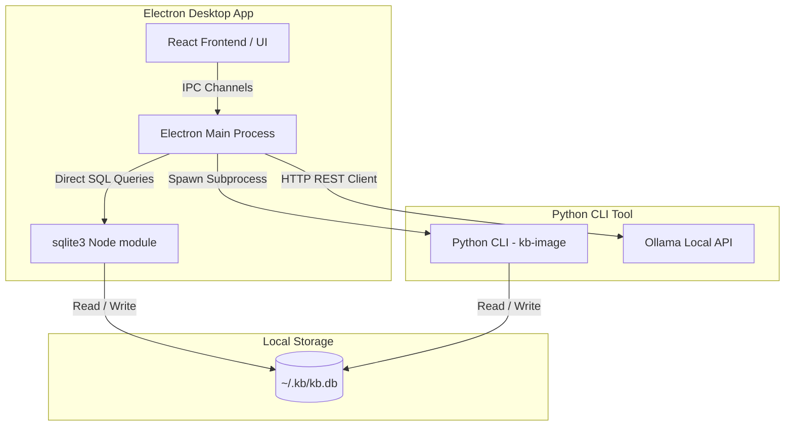

# kb-image

A standalone desktop application and CLI tool suite for cataloging, processing, and exploring personal images within the `kb` (Knowledge Base) stack.

This repository implements the `kb-image` service, housing a direct-access Electron application alongside python-based metadata analyzers, batch image importers, and AI enrichment capabilities.

---

## Architecture Overview



1. **React UI Frontend (`desktop/`)**: A fast, responsive, and minimalist UI designed with custom earth-toned solarized-light/retro-dark CSS aesthetics, offering deep catalog search, classification filters, active tag filters, and image detail drawers.
2. **Electron Shell (`desktop/`)**: Runs the desktop container. Uses native Node.js `sqlite3` to fetch thumbnails, query files, and write user tag edits directly to the local database, removing the overhead of local HTTP servers.
3. **AI Enrichment Processes**: Communicates directly with the local Ollama API (defaulting to `http://localhost:11414`) to run 1:1 image classification, tagging, and description prompts on the `gemma4:latest` multimodal model.
4. **Python Backend Submodule (`src/kb_image/`)**: CLI helper commands that handle high-performance binary scanning, thumbnail rendering, metadata (EXIF) compilation, and batch imports. Electron triggers URL imports by invoking `uv run kb-image import` as a subprocess.

---

## Installation & Setup

### Prerequisites
- [Node.js](https://nodejs.org/) (v18+)
- [Python 3.12+](https://www.python.org/) with `uv` package manager installed.
- [Ollama](https://ollama.com/) (running locally or accessible via network).

### Installation
Sync both environments from the repository root:
```powershell
# Setup python dependencies
uv sync

# Setup node dependencies
cd desktop
npm install
```

---

## Running the Application

### Launching the Desktop App
You can start the Electron application using the Python CLI interface:
```powershell
# Launch in production mode (loads pre-compiled frontend assets)
uv run kb-image serve

# Launch in developer mode (with hot reloading, points to localhost:3000)
uv run kb-image serve --dev
```

Alternatively, from the `desktop/` directory:
```powershell
# Start Vite development server
npm run dev

# Start Electron shell
npm start
```

### CLI Backend Commands
Manage imports and tagging directly from your shell:
```powershell
# Import a directory of local photos
uv run kb-image import --dir "C:/path/to/photos"

# Import a single web image URL
uv run kb-image import --url "https://example.com/image.png"

# Bulk tag untagged database images using Ollama
uv run kb-image tag --limit 50
```

---

## Development & Build Pipeline

The project includes an automated build pipeline script (`build.py`) which manages rebuilding binary modules, compiling the frontend, and packaging the standalone executable.

Run the build pipeline:
```powershell
python build.py
```

This performs the following steps:
1. **Frontend Compilation**: Builds Vite React assets to `desktop/dist-frontend/`.
2. **Native Node Rebuilds**: Recompiles the native `sqlite3` binary bindings for the target Electron node architecture.
3. **Executable Compilation**: Uses `electron-builder` to bundle the app into a single standalone portable executable (`desktop/dist/kb-image <version>.exe`).
4. **Python Testing**: Runs the unit test suite (`pytest`).
5. **Python Distribution**: Generates Python wheel files in `dist/`.

---

## Database Schema & Configuration

Both Python CLI and Electron processes connect to the local SQLite database at `~/.kb/kb.db`.

Key tables include:
- `image_files`: Metadata, EXIF tags, thumbnails, and base64 image data for local file imports.
- `web_images`: Metadata, source URL, thumbnails, and base64 image data for imported web links.

Structured fields (such as `tags` and `exif_data`) are stored as JSON strings. The Electron database interface automatically parses these fields into JavaScript arrays and objects when reading.
